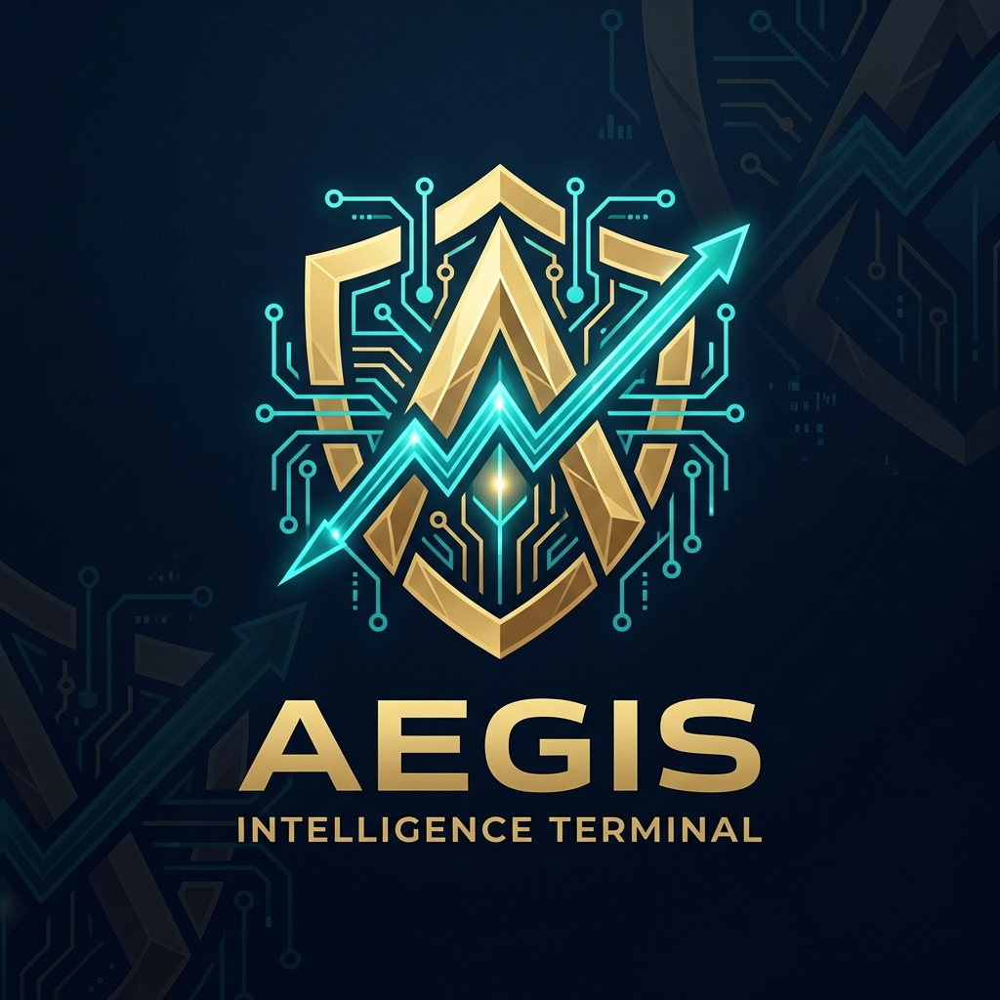

<p align="center">
  
</p>

# Aegis Intelligence Terminal (v1.0.0)


Aegis Terminal is a next-generation AI trading platform with a **LangGraph-based Multi-Agent architecture**, capable of making autonomous decisions in financial markets (Crypto, Stocks, Forex).

[**Changelog**](CHANGELOG.md) | [**Contributing**](CONTRIBUTING.md) | [**Documentation**](docs/INDEX.md) | [**Türkçe README**](docs/TR/README_TR.md)

---

## 🚀 Project Overview

This system combines traditional technical analysis (MACD, RSI, Bollinger) with modern Large Language Model (LLM) capabilities. It analyzes not just numbers, but also market news and social sentiment. To manage "hallucination" risks, it employs a **Bull vs Bear Debate Panel** and an independent **Risk Management** layer.

### Key Features
- **Multi-Agent Workflow:** Hierarchical communication between Coordinator, Research, Debate, Risk, and Trader agents.
- **Sentiment Analysis:** LLM-driven sentiment scoring of news and social data.
- **Paper Trading Mode:** Real-time strategy testing without financial risk.
- **Portfolio Optimization:** Dynamic cash allocation across multiple assets (CVaR).
- **Smart Protection (Watchdog):** Emergency liquidation in seconds during flash crashes.
- **Cost Efficiency:** Up to 80% API savings through prompt compression and caching.

---

## 📁 Project Structure

| Folder / File | Description |
|----------------|-------------|
| `agents/` | Logic for all AI agents (Debate, Risk, Trader, etc.) |
| `config/` | Strategy and exchange configuration files |
| `dashboard/` | Web-based monitoring panel (P&L and Portfolio view) |
| `data/` | Market data, balances, and temporary caches |
| `docs/` | Comprehensive documentation and platform guides |
| `execution/` | Exchange connectivity and order transmission systems |
| `scripts/` | Scripts to run and test the bot |
| `tests/` | Integration and unit tests |

---

## 🛠️ Installation & Usage

Follow these steps to get started quickly:

```bash
# Create and activate virtual environment
python -m venv venv
source venv/bin/activate  # On Windows: venv\Scripts\activate

# Install dependencies
pip install -e .

# Configure environment variables
cp .env.example .env  # Add your API keys to this file
```

### Quick Start
Use the CLI to launch the system:

```bash
# Start paper trading for BTC/USDT with 1h intervals
aegis run --symbol BTC/USDT --interval 1h --watchdog
```

For more details:
- 📖 [**Quick Start Guide**](docs/setup/QUICK_START.md)
- ⚙️ [**Live Trading Setup**](docs/setup/LIVE_TRADING.md)
- 📜 [**CLI Command Reference**](docs/TR/CLI_KOMUTLARI.md)

---

## 🛡️ Security & Risk Warning

This software is an autonomous system. It is strongly recommended to test in **Paper Trading** mode for at least 48 hours before live trading and to carefully review risk limits in `config/trading_params.yaml`.

---

## 📄 License
This project is licensed under the [MIT License](LICENSE).
